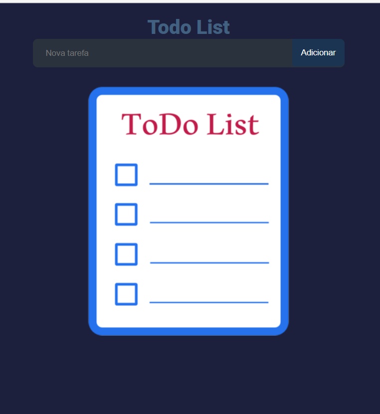

#  Todo List App

Aplicação desenvolvida em React que permite criar, concluir e remover tarefas, com persistência de dados no navegador através do Local Storage.

Projeto focado na consolidação de React Hooks, gestão de estado e boas práticas de desenvolvimento front-end.

---

##  Preview

<p align="center">
  
</p>

--- 

##  Funcionalidades

-  Adicionar novas tarefas  
-  Marcar tarefas como concluídas  
-  Remover tarefas  
-  Persistência automática no navegador  
-  Interface simples e responsiva  

---

##  Tecnologias Utilizadas

- React  
- JavaScript (ES6+)  
- CSS3  
- React Hooks (useState, useEffect)  
- Local Storage API  

---

##  Conceitos Aplicados

- Gestão de estado com Hooks  
- Renderização condicional  
- Manipulação de arrays (map, filter)  
- Atualização imutável de estado  
- Persistência de dados no browser  

---

## ▶ Como Executar o Projeto

```bash
npm install
npm run dev
